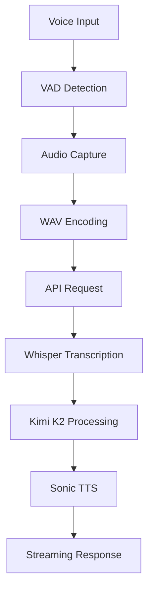
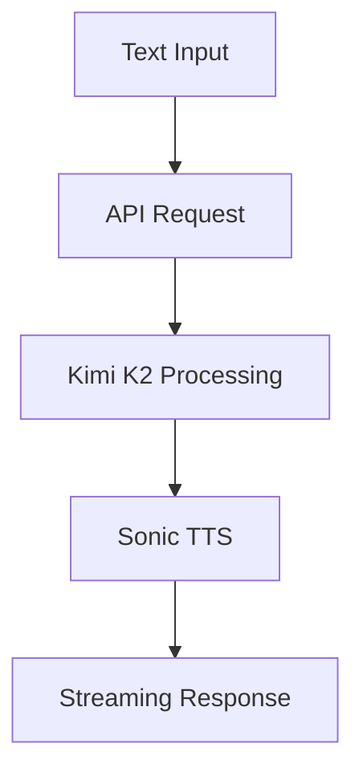

# API Documentation

This document details the VoiceSwift API endpoints, request/response formats, and integration guidelines.

## 📡 API Overview

VoiceSwift uses a single API endpoint for processing voice and text inputs, returning streaming audio responses.

### Base URL
```
POST /api
```

### Content Type
```
Content-Type: multipart/form-data
```

## 🔧 Request Format

### Form Data Structure

```javascript
const formData = new FormData();

// Required: Input data (voice or text)
formData.append("input", audioBlob); // For voice input
// OR
formData.append("input", "Hello world"); // For text input

// Optional: Conversation history
formData.append("message", JSON.stringify({
    role: "user",
    content: "Previous message"
}));
```

### Input Types

#### Voice Input
- **Type**: `Blob` (WAV format)
- **Source**: VAD-captured audio
- **Processing**: Automatic transcription via Whisper
- **Format**: `audio/wav`

#### Text Input
- **Type**: `string`
- **Source**: Manual text entry
- **Processing**: Direct LLM processing (no transcription)
- **Format**: Plain text

### Conversation History

```javascript
// Multiple messages supported
formData.append("message", JSON.stringify({
    role: "user",
    content: "Hello!"
}));

formData.append("message", JSON.stringify({
    role: "assistant",
    content: "Hi there! How can I help?"
}));
```

## 📤 Response Format

### Success Response (200)
```javascript
// Response body: ReadableStream (audio data)
// Headers:
{
    "X-Transcript": "encoded_transcript",
    "X-Response": "encoded_response_text"
}
```

### Response Headers

#### X-Transcript
- **Type**: URL-encoded string
- **Content**: Transcribed text from audio input
- **Usage**: Display what the user said
- **Decoding**: `decodeURIComponent(headerValue)`

#### X-Response
- **Type**: URL-encoded string
- **Content**: AI-generated response text
- **Usage**: Display assistant's response
- **Decoding**: `decodeURIComponent(headerValue)`

### Audio Stream
- **Format**: Raw PCM f32le audio
- **Sample Rate**: 24kHz
- **Channels**: Mono
- **Content-Type**: Not set (streaming response)

## 🚨 Error Responses

### 400 Bad Request
```json
"Invalid request"
```
**Causes**:
- Missing or invalid form data
- Unsupported input format
- Schema validation failure

### 500 Internal Server Error
```json
"Invalid response"
"Voice synthesis failed"
```
**Causes**:
- AI model failures
- TTS synthesis errors
- Network connectivity issues

### 429 Too Many Requests
```json
// Handled by frontend toast notification
"Too many requests. Please try again later."
```

## 🔄 Processing Flow

### Voice Input Flow


### Text Input Flow


## 📊 Performance Metrics

### Latency Breakdown
- **VAD Detection**: ~50ms
- **Audio Processing**: ~150ms
- **Whisper Transcription**: ~200ms
- **LLM Processing**: ~300ms
- **TTS Generation**: ~300ms
- **Total**: ~1 second

### Rate Limits
- **Requests per minute**: Varies by API provider
- **Concurrent requests**: Limited by browser and server
- **Audio size limit**: Determined by API constraints

## 🔧 Integration Examples

### JavaScript/TypeScript

```javascript
// Voice input example
async function sendVoice(audioBlob) {
    const formData = new FormData();
    formData.append("input", audioBlob, "audio.wav");

    // Add conversation history
    formData.append("message", JSON.stringify({
        role: "user",
        content: "Hello"
    }));

    const response = await fetch("/api", {
        method: "POST",
        body: formData
    });

    if (response.ok) {
        const transcript = decodeURIComponent(
            response.headers.get("X-Transcript") || ""
        );
        const text = decodeURIComponent(
            response.headers.get("X-Response") || ""
        );

        // Play audio stream
        playAudio(response.body);
    }
}

// Text input example
async function sendText(message) {
    const formData = new FormData();
    formData.append("input", message);

    const response = await fetch("/api", {
        method: "POST",
        body: formData
    });

    // Handle response...
}
```

### React Hook Example

```typescript
// Custom hook for VoiceSwift API
function useVoiceSwift() {
    const [isLoading, setIsLoading] = useState(false);

    const sendMessage = async (input, history = []) => {
        setIsLoading(true);

        const formData = new FormData();
        formData.append("input", input);

        history.forEach(msg => {
            formData.append("message", JSON.stringify(msg));
        });

        try {
            const response = await fetch("/api", {
                method: "POST",
                body: formData
            });

            const transcript = decodeURIComponent(
                response.headers.get("X-Transcript") || ""
            );
            const text = decodeURIComponent(
                response.headers.get("X-Response") || ""
            );

            return {
                transcript,
                text,
                audioStream: response.body
            };
        } finally {
            setIsLoading(false);
        }
    };

    return { sendMessage, isLoading };
}
```

## 🔒 Security Considerations

### API Key Management
- Store API keys in environment variables
- Never expose keys in client-side code
- Rotate keys regularly
- Monitor usage for unauthorized access

### Input Validation
- Validate all form data on server side
- Sanitize text inputs
- Check file types and sizes
- Implement rate limiting

### CORS Configuration
```javascript
// Next.js configuration
{
    async headers() {
        return [
            {
                source: "/api/(.*)",
                headers: [
                    { key: "Access-Control-Allow-Origin", value: "*" },
                    { key: "Access-Control-Allow-Methods", value: "POST" },
                    { key: "Access-Control-Allow-Headers", value: "Content-Type" }
                ]
            }
        ];
    }
}
```

## 🧪 Testing & Debugging

### API Testing Tools

#### cURL Example
```bash
# Text input test
curl -X POST http://localhost:3000/api \
  -F "input=Hello world"

# Voice input test
curl -X POST http://localhost:3000/api \
  -F "input=@audio.wav"
```

#### Postman Configuration
- **Method**: POST
- **URL**: `{{base_url}}/api`
- **Body**: form-data
- **Key**: `input`
- **Value**: File or text

### Debug Headers
```javascript
// Enable debug logging
const response = await fetch("/api", {
    method: "POST",
    body: formData,
    headers: {
        "X-Debug": "true"
    }
});
```

### Common Debug Scenarios

#### Transcription Issues
```javascript
// Check audio format
console.log("Audio blob:", audioBlob.type, audioBlob.size);

// Verify API response
console.log("Transcript:", transcript);
```

#### TTS Problems
```javascript
// Check response headers
console.log("Response headers:", Object.fromEntries(response.headers));

// Verify audio stream
console.log("Stream readable:", response.body);
```

## 📈 Monitoring & Analytics

### Response Tracking
```javascript
const startTime = Date.now();

const response = await fetch("/api", {
    method: "POST",
    body: formData
});

const latency = Date.now() - startTime;
console.log(`API Latency: ${latency}ms`);
```

### Error Monitoring
```javascript
try {
    const response = await fetch("/api", {
        method: "POST",
        body: formData
    });

    if (!response.ok) {
        throw new Error(`API Error: ${response.status}`);
    }
} catch (error) {
    // Log error and handle gracefully
    console.error("API call failed:", error);
}
```

## 🚀 Advanced Usage

### Streaming Audio Handling
```javascript
async function playStreamingAudio(stream) {
    const audioContext = new AudioContext({ sampleRate: 24000 });
    const reader = stream.getReader();

    while (true) {
        const { done, value } = await reader.read();
        if (done) break;

        // Process audio chunk
        const audioBuffer = audioContext.createBuffer(1, value.length / 4, 24000);
        const channelData = new Float32Array(value.buffer);
        audioBuffer.copyToChannel(channelData, 0);

        // Play chunk
        const source = audioContext.createBufferSource();
        source.buffer = audioBuffer;
        source.connect(audioContext.destination);
        source.start();
    }
}
```

### Conversation Management
```javascript
class ConversationManager {
    constructor() {
        this.messages = [];
    }

    addMessage(role, content) {
        this.messages.push({ role, content });
    }

    getFormData(input) {
        const formData = new FormData();
        formData.append("input", input);

        this.messages.forEach(msg => {
            formData.append("message", JSON.stringify(msg));
        });

        return formData;
    }

    async sendMessage(input) {
        const formData = this.getFormData(input);
        const response = await fetch("/api", {
            method: "POST",
            body: formData
        });

        // Handle response and update conversation
        const transcript = decodeURIComponent(
            response.headers.get("X-Transcript") || ""
        );
        const text = decodeURIComponent(
            response.headers.get("X-Response") || ""
        );

        this.addMessage("user", transcript);
        this.addMessage("assistant", text);

        return { transcript, text, audio: response.body };
    }
}
```

## 🔗 Related Documentation

- **[SETUP.md](./SETUP.md)** - Environment configuration
- **[MODELS.md](./MODELS.md)** - AI model specifications
- **[AUDIO_SYSTEM.md](./AUDIO_SYSTEM.md)** - Audio processing details
- **[FEATURES.md](./FEATURES.md)** - Feature capabilities

## 📞 Support

For API integration questions:
- Check the troubleshooting section above
- Review error handling examples
- Test with provided cURL examples
- Create an issue for specific problems

The API is designed for simplicity while providing powerful voice AI capabilities with streaming audio support.
