# System Architecture & Data Flow

This document provides a comprehensive overview of VoiceSwift's system architecture, data flow, and technical implementation.

## 🏗️ High-Level Architecture


## 🔄 Complete Data Flow

### 1. User Interaction Layer

```mermaid
graph LR
    User((👤 User)) --> Input{Input Type}
    Input -->|Voice| VAD
    Input -->|Text| Direct

    VAD[Voice Activity Detection] --> Audio[Audio Capture]
    Audio --> API[API Processing]

    Direct[Text Input] --> API

    API --> Response[Streaming Response]
    Response --> Playback[Audio Playback]
    Playback --> User
```



### 2. Audio Processing Pipeline

```mermaid
graph TD
    A[🎤 Raw Audio] --> B[VAD Analysis]
    B --> C[Speech Detection]
    C --> D[Audio Segmentation]
    D --> E[WAV Encoding]
    E --> F[HTTP Transmission]
    F --> G[Whisper Transcription]
    G --> H[Text Output]
```



### 3. AI Processing Chain

```mermaid
graph TD
    A[📝 Input Text] --> B[System Prompt]
    B --> C[Conversation History]
    C --> D[Context Integration]
    D --> E[Kimi K2 Processing]
    E --> F[Response Generation]
    F --> G[TTS Optimization]
    G --> H[Sonic Turbo Synthesis]
    H --> I[Audio Streaming]
```



## 📦 Component Architecture

### Frontend Components

#### User Interface (`app/page.tsx`)
```typescript
export default function Home() {
    // State management
    const [input, setInput] = useState("");
    const inputRef = useRef<HTMLInputElement>(null);
    const player = usePlayer();

    // VAD integration
    const vad = useMicVAD({ ... });

    // Form submission
    const [messages, submit, isPending] = useActionState(...);
}
```

#### Audio Player (`app/lib/usePlayer.ts`)
```typescript
export function usePlayer() {
    const [isPlaying, setIsPlaying] = useState(false);
    const audioContext = useRef<AudioContext | null>(null);
    const source = useRef<AudioBufferSourceNode | null>(null);

    // Streaming playback
    async function play(stream: ReadableStream, callback: () => void) {
        // Audio processing logic
    }

    // Cleanup
    function stop() {
        audioContext.current?.close();
        audioContext.current = null;
        setIsPlaying(false);
    }
}
```

### Backend Components

#### API Route (`app/api/route.ts`)
```typescript
export async function POST(request: Request) {
    // Input validation
    const { data, success } = schema.safeParse(await request.formData());

    // Audio transcription
    const transcript = await getTranscript(data.input);

    // AI processing
    const completion = await groq.chat.completions.create({ ... });

    // Text-to-speech
    const voice = await fetch("https://api.cartesia.ai/tts/bytes", { ... });

    // Streaming response
    return new Response(voice.body, { headers: { ... } });
}
```

## 🔧 Technical Stack Details

### Frontend Technologies

| Component | Technology | Purpose |
|-----------|------------|---------|
| **Framework** | Next.js 15 | React framework with SSR |
| **Language** | TypeScript | Type safety |
| **Styling** | Tailwind CSS | Utility-first CSS |
| **State** | React Hooks | Component state management |
| **Audio** | Web Audio API | Browser audio processing |
| **VAD** | @ricky0123/vad-react | Voice activity detection |

### Backend Technologies

| Component | Technology | Purpose |
|-----------|------------|---------|
| **Runtime** | Next.js API Routes | Serverless functions |
| **Validation** | Zod | Schema validation |
| **AI Client** | Groq SDK | AI service integration |
| **HTTP Client** | Fetch API | External API calls |
| **Streaming** | ReadableStream | Audio streaming |

### External Services

| Service | Provider | Purpose |
|---------|----------|---------|
| **LLM** | Groq + Moonshot AI | Text generation (Kimi K2) |
| **Transcription** | Groq + OpenAI | Speech-to-text (Whisper Turbo) |
| **TTS** | Cartesia | Text-to-speech (Sonic Turbo) |
| **Deployment** | Vercel | Hosting and CDN |
| **Analytics** | Vercel Analytics | Usage tracking |

## 🌐 Network Architecture

### API Call Flow


### Data Formats

#### Request Flow
```typescript
// 1. Form Data → Next.js
Content-Type: multipart/form-data
{
    input: Blob | string,
    message: JSON[]
}

// 2. Next.js → Groq (Transcription)
{
    file: audioBlob,
    model: "whisper-large-v3-turbo"
}

// 3. Next.js → Groq (LLM)
{
    model: "moonshotai/kimi-k2-instruct-0905",
    messages: [...],
    // ... other params
}

// 4. Next.js → Cartesia
{
    model_id: "sonic-turbo",
    transcript: "response text",
    voice: { id: "voice-id" },
    output_format: { ... }
}
```

#### Response Flow
```typescript
// Cartesia → Next.js → Client
Content-Type: audio/pcm
Stream: ReadableStream<Uint8Array>

// Headers
X-Transcript: "url-encoded transcript"
X-Response: "url-encoded response"
```

## 💾 State Management

### Client State
```typescript
// Component state
const [input, setInput] = useState("");           // Text input
const [messages, submit, isPending] = useActionState(...); // Conversation

// Audio state
const [isPlaying, setIsPlaying] = useState(false); // Playback status

// VAD state
const vad = useMicVAD({ ... }); // Speech detection state
```

### Server State
```typescript
// Request processing (stateless)
// Each request is independent
// Conversation history passed via form data
// No server-side session management
```

### Data Persistence
- **Conversation History**: Client-side storage in React state
- **Audio Buffers**: Temporary Web Audio API buffers
- **API Responses**: Streaming (not persisted)
- **User Preferences**: Not currently implemented

## 🔄 Processing Pipeline

### Voice Input Processing

1. **Speech Detection** → VAD identifies speech segments
2. **Audio Capture** → Raw audio captured from microphone
3. **Format Conversion** → Audio converted to WAV blob
4. **API Transmission** → Form data sent to Next.js API
5. **Transcription** → Whisper Turbo converts speech to text
6. **AI Processing** → Kimi K2 generates response
7. **TTS Synthesis** → Sonic Turbo converts text to audio
8. **Streaming Response** → Audio streamed back to client
9. **Playback** → Web Audio API plays the response

### Text Input Processing

1. **Input Reception** → Text received via form submission
2. **AI Processing** → Kimi K2 generates response (no transcription)
3. **TTS Synthesis** → Sonic Turbo converts text to audio
4. **Streaming Response** → Audio streamed back to client
5. **Playback** → Web Audio API plays the response

## 🚀 Performance Optimizations

### Latency Optimizations

#### Frontend
- **Streaming Audio**: Immediate playback without waiting
- **VAD Optimization**: ML model runs in WebAssembly
- **Chunked Processing**: Audio processed in small chunks
- **Memory Management**: Automatic cleanup of audio resources

#### Backend
- **Edge Computing**: Vercel deployment for low latency
- **Concurrent Processing**: Parallel API calls where possible
- **Streaming Responses**: No buffering of complete responses
- **Caching**: Efficient resource utilization

#### Network
- **CDN Distribution**: Global content delivery
- **Regional Deployment**: SFO1 region optimization
- **HTTP/2**: Multiplexed request handling
- **Compression**: Efficient data transmission

### Resource Management

#### Memory Optimization
```typescript
// Automatic cleanup
function stop() {
    audioContext.current?.close();    // Free audio resources
    audioContext.current = null;      // Clear references
    setIsPlaying(false);              // Update UI state
}
```

#### Connection Pooling
- **HTTP Keep-Alive**: Persistent connections to APIs
- **Request Batching**: Efficient API call patterns
- **Timeout Management**: Automatic request cancellation
- **Retry Logic**: Failed request recovery

## 🛡️ Security Architecture

### API Security
- **Environment Variables**: Sensitive keys stored securely
- **Input Validation**: Server-side validation with Zod
- **Rate Limiting**: Built-in request throttling
- **CORS Policy**: Proper cross-origin configuration

### Client Security
- **HTTPS Only**: Secure communication required
- **Permission Management**: Microphone access control
- **Input Sanitization**: Client-side data cleaning
- **Error Handling**: Secure error message display

### Data Protection
- **No Data Persistence**: Conversations not stored
- **Secure Transmission**: HTTPS for all communications
- **API Key Rotation**: Regular key updates
- **Access Control**: Proper authentication mechanisms

## 📊 Monitoring & Observability

### Performance Metrics
```typescript
// Latency tracking
const submittedAt = Date.now();
// ... API call ...
const latency = Date.now() - submittedAt;
```

### Error Tracking
```typescript
// Error boundaries
try {
    // API operations
} catch (error) {
    // Error logging and recovery
}
```

### Analytics Integration
- **Vercel Analytics**: User interaction tracking
- **Performance Monitoring**: Response time analysis
- **Error Reporting**: Failure pattern identification
- **Usage Statistics**: Feature adoption metrics

## 🔧 Deployment Architecture

### Vercel Configuration
```json
{
    "regions": ["sfo1"],
    "functions": {
        "app/api/**/*.ts": {
            "maxDuration": 30
        }
    }
}
```

### Environment Setup
```bash
# Required environment variables
GROQ_API_KEY=...
CARTESIA_API_KEY=...
VERCEL_ANALYTICS_ID=...
```

### Build Configuration
```typescript
// next.config.ts
const nextConfig: NextConfig = {
    async headers() {
        return [
            {
                source: "/(.*)",
                headers: [
                    {
                        key: "Cross-Origin-Opener-Policy",
                        value: "same-origin",
                    },
                    {
                        key: "Cross-Origin-Embedder-Policy",
                        value: "require-corp",
                    },
                ],
            },
        ];
    },
};
```

## 🚀 Scaling Considerations

### Horizontal Scaling
- **Serverless Functions**: Automatic scaling on Vercel
- **API Rate Limits**: Distributed across multiple providers
- **CDN Caching**: Global content delivery optimization
- **Load Balancing**: Automatic request distribution

### Performance Scaling
- **Edge Computing**: Reduced latency through geographic distribution
- **Streaming Optimization**: Reduced memory usage
- **Concurrent Processing**: Parallel API call handling
- **Resource Optimization**: Efficient memory and CPU usage

## 🔮 Future Architecture

### Planned Enhancements
- **Microservices**: Separate services for different functions
- **Database Integration**: Conversation history persistence
- **Caching Layer**: Response caching for common queries
- **Real-time Features**: WebSocket support for live updates

### Advanced Features
- **Multi-user Support**: Concurrent conversation handling
- **Custom Models**: Personalized AI model training
- **Offline Mode**: Local processing capabilities
- **API Extensions**: Third-party integration support

This architecture provides a solid foundation for a high-performance voice AI assistant with room for future enhancements and scaling.
